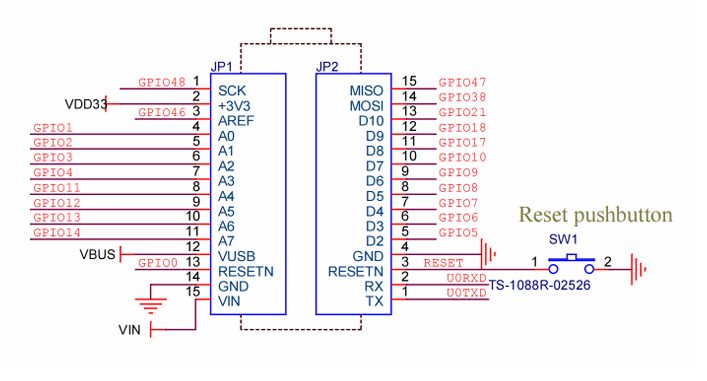

# 温室监控系统 - WiFi热点版本

## 项目概述

这是一个基于Arduino Nano ESP32和240x320 LCD显示屏的温室监控系统，集成了多种传感器用于全面监控温室环境。系统采用模块化设计，支持传感器热插拔，即使某些传感器失效也能正常工作。**最新更新：支持WiFi热点功能，可通过手机或电脑的Web浏览器实时监控！**

## 🔥 新功能亮点

### WiFi热点监控
- **无需安装App**：任何设备的浏览器都可访问
- **现代化Web界面**：响应式设计，自动适配手机和电脑
- **实时数据更新**：3秒自动刷新，支持手动刷新
- **多设备支持**：同时支持多个设备连接监控
- **离线访问**：不需要互联网连接，ESP32直接提供Web服务

### 快速使用指南
1. 上传代码到Arduino Nano ESP32
2. 打开串口监视器查看WiFi信息
3. 手机/电脑连接WiFi热点："ESP32_Greenhouse"（密码：12345678）
4. 浏览器访问：192.168.4.1
5. 享受实时监控！

## 当前文件结构

```
Greenhouse_monitor/
├── Greenhouse_monitor.ino   # 主程序文件（系统协调和主循环）
├── display_manager.ino      # 显示管理模块（LCD控制和图表绘制）
├── wifi_manager.ino         # WiFi热点和Web服务器模块 🆕
├── sensors_temp_humid.ino   # AHT30温湿度传感器模块
├── sensors_pressure.ino     # BMP180气压传感器模块
├── sensors_co2.ino         # SGP30 CO2传感器模块
├── sensors_light.ino       # BH1750光照传感器模块
├── time_manager.ino        # 时间管理模块
├── device_control.ino      # 设备控制模块（蜂鸣器报警系统）
└── README.md              # 说明文档
```

## 硬件连接

### ESP32引脚分配
```
LCD显示屏 (ST7789):
├── SCLK → GPIO 3
├── MOSI → GPIO 4  
├── DC   → GPIO 12
├── RST  → GPIO 11  
├── CS   → GPIO 13
└── BLK  → GPIO 14

AHT30温湿度传感器 (I2C):
├── SDA → GPIO 7
└── SCL → GPIO 6

BMP180气压传感器 (I2C):
├── SDA → GPIO 6
└── SCL → GPIO 5

SGP30 CO2传感器 (I2C):
├── SDA → GPIO 6
└── SCL → GPIO 5

BH1750光照传感器 (I2C):
├── SDA → GPIO 6
├── SCL → GPIO 5
└── ADDR → GPIO 8  (地址选择引脚)

蜂鸣器 (数字输出):
└── 信号 → GPIO 9
```

### Arduino IDE开发板配置

**重要**：确保Arduino IDE中选择了正确的开发板配置：

1. **开发板选择**：
   - 工具 → 开发板 → Arduino ESP32 Boards → **Arduino Nano ESP32**
   - 如果你的开发板没有自动识别为Arduino NANO ESP32，请手动切换到此选项

2. **引脚编号模式**：
   - 工具 → Pin Numbering → **By GPIO number**
   - 这确保代码中的引脚号对应GPIO号码，而不是开发板上的物理引脚号

3. **其他设置**：
   - 端口：选择对应的COM端口
   - 上传速度：921600（推荐）或115200
   - 分区方案：Default 4MB with spiffs

4. **编程器配置**（首次上传必需）：
   - 工具 → 编程器 → **Esptool**
   
5. **代码上传方式**：
   - **首次上传**：项目 → 使用编程器上传（必须使用此方式）
   - **后续上传**：直接点击上传按钮即可

### 电源连接
- LCD显示屏：3.3V
- AHT30传感器：3.3V
- BMP180传感器：3.3V
- SGP30传感器：3.3V
- BH1750传感器：3.3V
- 蜂鸣器：3.3V (或5V，取决于具体型号)

### I2C地址分配
- AHT30：0x38
- BMP180：0x77
- SGP30：0x58
- BH1750：0x23 (ADDR引脚为LOW) / 0x5C (ADDR引脚为HIGH)

## 需要安装的库

在Arduino IDE中安装以下库：

1. **LovyanGFX** - LCD显示库
   - 工具 → 管理库 → 搜索"LovyanGFX"

2. **WiFi** - ESP32 WiFi库（ESP32内置，无需安装）

3. **WebServer** - ESP32 Web服务器库（ESP32内置，无需安装）

4. **Adafruit AHTX0** - AHT30温湿度传感器
   - 工具 → 管理库 → 搜索"Adafruit AHTX0"

5. **Adafruit BMP085 Library** - BMP180气压传感器
   - 工具 → 管理库 → 搜索"Adafruit BMP085"

6. **Adafruit SGP30** - SGP30 CO2传感器
   - 工具 → 管理库 → 搜索"Adafruit SGP30"

7. **BH1750** - BH1750光照传感器
   - 工具 → 管理库 → 搜索"BH1750"

8. **Wire** - I2C通信库（ESP32内置）

9. **Adafruit Sensor** - 传感器抽象库
   - 工具 → 管理库 → 搜索"Adafruit Unified Sensor"

## 功能特性

### ✅ 已实现功能

#### 🌐 WiFi热点Web监控（最新功能）
- **WiFi热点模式**：
  - 热点名称：ESP32_Greenhouse
  - 热点密码：12345678
  - IP地址：192.168.4.1
- **现代化Web界面**：
  - 响应式设计，支持手机和电脑访问
  - 实时数据显示（温度、湿度、气压、CO2、光照）
  - 系统状态监控和运行时间显示
  - 3秒自动刷新，支持手动刷新
- **RESTful API**：
  - `/api/data` - 获取传感器数据（JSON格式）
  - `/api/status` - 获取系统状态和连接数
  - `/api/restart` - 重启ESP32（POST请求）
- **多设备支持**：
  - 同时支持多个设备连接
  - 显示当前连接设备数量
  - 无需安装任何App，浏览器直接访问

#### 📱 本地LCD显示界面
- **240x320 LCD显示界面** - 高分辨率彩色显示
- **WiFi状态显示** - 显示热点状态和连接设备数量
- **多传感器集成**：
  - AHT30温湿度传感器实时读取
  - BMP180气压传感器实时读取（气压值和海拔估算）
  - SGP30 CO2传感器实时读取（CO2和TVOC）
  - BH1750光照传感器实时读取（高精度光照强度）
- **温度趋势图表**：
  - 实时温度曲线显示
  - 最大50个数据点历史记录
  - 10秒间隔数据采集
  - 最高/最低温度显示
- **智能传感器管理**：
  - **非阻塞传感器初始化**（3秒超时保护，不会卡住）
  - **传感器连接状态检测**（显示"disconnected"当传感器未连接）
  - **启动状态显示**（显示传感器初始化进度）
  - **容错运行**（即使部分传感器失效也能正常工作）
- **数据状态指示**：
  - 彩色状态指示器（正常/警告/异常/未连接）
  - 温湿度、CO2阈值监控
  - 实时数据验证
- **时间显示**：
  - 运行时间显示（从设备启动开始计算）
  - 图表时间轴管理
- **蜂鸣器报警系统**：
  - **启动提示音**：系统启动完成时播放（短-长-短节奏）
  - **异常监控**：实时检测温度、湿度、CO2异常情况
  - **智能报警**：根据异常严重程度播放不同提示音
  - **防骚扰设计**：设置报警间隔，避免频繁鸣叫
  - **可控制开关**：支持蜂鸣器启用/禁用
- **串口调试输出** - 详细的传感器状态信息

### 🔄 模拟显示功能
- 土壤湿度显示（模拟数据）
- 设备状态显示（水泵、风扇、补光灯）

## 启动流程

1. **LCD优先初始化** - 确保屏幕能立即显示状态
2. **蜂鸣器初始化** - 初始化报警系统
3. **显示启动界面** - "System Starting..." 和传感器初始化进度
4. **传感器初始化** - 每个传感器有3秒超时保护：
   - AHT30温湿度传感器
   - BMP180气压传感器  
   - SGP30 CO2传感器
   - BH1750光照传感器
5. **状态反馈** - 显示哪些传感器成功/失败 (x/4 sensors ready)
6. **启动完成提示音** - 播放启动完成音乐（短-长-短节奏）
7. **进入正常运行** - 即使部分传感器失败也能正常工作，并开始异常监控

### 启动界面显示
```
Greenhouse Monitor  00:00
System Starting...
Initializing Sensors
AHT30...
BMP180...
SGP30...
BH1750...
4/4 sensors ready!    (或 "3/4 sensors ready" / "No sensors found")
```

## 📖 使用指南

### 方法一：WiFi热点Web监控（推荐）
1. **上传代码**：将代码上传到Arduino Nano ESP32
2. **查看串口信息**：打开串口监视器，查看WiFi热点信息
3. **连接WiFi**：
   - 热点名称：`ESP32_Greenhouse`
   - 密码：`12345678`
4. **打开浏览器**：访问 `http://192.168.4.1`
5. **享受监控**：现代化Web界面，支持多设备同时访问

### 方法二：本地LCD显示
- LCD屏幕直接显示传感器数据、状态和温度趋势图
- WiFi状态和连接设备数量显示

### 系统启动流程

1. **LCD优先初始化** - 确保屏幕能立即显示状态
2. **WiFi热点启动** - 创建ESP32_Greenhouse热点 🆕
3. **蜂鸣器初始化** - 初始化报警系统
4. **显示启动界面** - "System Starting..." 和传感器初始化进度
5. **传感器初始化** - 每个传感器有3秒超时保护：
   - AHT30温湿度传感器
   - BMP180气压传感器  
   - SGP30 CO2传感器
   - BH1750光照传感器
6. **状态反馈** - 显示哪些传感器成功/失败 (x/4 sensors ready)
7. **启动完成提示音** - 播放启动完成音乐（短-长-短节奏）
8. **进入正常运行** - 即使部分传感器失败也能正常工作，并开始异常监控

### 启动界面显示
```
Greenhouse Monitor  00:00
WiFi: ESP32_Greenhouse ★
System Starting...
Initializing Sensors
AHT30...
BMP180...
SGP30...
BH1750...
4/4 sensors ready!    (或 "3/4 sensors ready" / "No sensors found")
```

## 🔧 配置和安装

### 硬件连接
按照上面的引脚分配连接LCD和所有传感器

### 安装库
在Arduino IDE中安装必要的库

### 配置Arduino IDE
- 确保选择正确的开发板：工具 → 开发板 → Arduino ESP32 Boards → **Arduino Nano ESP32**
- 设置引脚编号模式：工具 → Pin Numbering → **By GPIO number**
- 配置编程器：工具 → 编程器 → **Esptool**
- 选择正确的COM端口

### 修改引脚
如需修改引脚，在对应的传感器文件中修改：
- AHT30引脚：在 `sensors_temp_humid.ino` 中修改 `NEW_SDA_PIN` 和 `NEW_SCL_PIN`
- BMP180引脚：在 `sensors_pressure.ino` 中修改 `BMP_SDA_PIN` 和 `BMP_SCL_PIN`
- SGP30引脚：在 `sensors_co2.ino` 中修改I2C引脚
- BH1750引脚：在 `sensors_light.ino` 中修改 `LIGHT_SDA_PIN`、`LIGHT_SCL_PIN` 和 `LIGHT_ADDR_PIN`

### 上传代码
- 在Arduino IDE中打开`Greenhouse_monitor.ino`
- **首次上传**：项目 → **使用编程器上传**
- **后续上传**：直接点击上传按钮即可

## 🌐 Web界面功能

访问 `http://192.168.4.1` 后，你将看到：

### 📊 实时数据显示
- 温度（°C）
- 湿度（%）
- 气压（hPa）
- CO2浓度（ppm）
- 光照强度（lux）
- 系统运行时间

### 🎛️ 控制功能
- **刷新数据**：手动刷新传感器数据
- **自动刷新**：开启/关闭自动刷新（默认3秒间隔）
- **状态监控**：实时显示系统状态（正常/警告/错误）
- **连接统计**：显示当前连接的设备数量

### 📱 响应式设计
- 自动适配手机、平板、电脑屏幕
- 现代化界面设计
- 彩色状态指示器
- 流畅的用户体验

## 显示界面说明

```
┌─────────────────────────┐
│ Greenhouse Monitor 01:23│  ← 标题栏（带实时时间）
├─────────────────────────┤
│ Temperature  25.3°C  ●  │  ← 温度（实际读取）
│ Humidity     65.2%   ●  │  ← 湿度（实际读取）
│ Pressure     1013hPa ●  │  ← 气压（实际读取）
│ CO2          800ppm  ●  │  ← CO2浓度（实际读取）
│ Light        25000lux●  │  ← 光照强度（实际读取）
├─────────────────────────┤
│ Temperature Trend (°C)  │  ← 图表标题
│ ┌─────────────────────┐ │
│ │    /\    /\    /\   │ │  ← 温度趋势曲线图
│ │   /  \  /  \  /  \  │ │
│ │  /    \/    \/    \ │ │
│ └─────────────────────┘ │
│ Min: 22.1°C Max: 26.8°C │  ← 最高/最低温度
└─────────────────────────┘
```

### 状态指示器颜色
- 🟢 绿色：数值正常
- 🟡 黄色：数值接近阈值边界
- 🔴 红色：数值超出正常范围或传感器未连接
- **disconnected**：传感器初始化失败或未连接

## 配置说明

如需修改传感器引脚，直接在对应的传感器文件中修改：

### WiFi热点配置 (`wifi_manager.ino`)
```cpp
const char* hotspot_ssid = "ESP32_Greenhouse";     // WiFi热点名称
const char* hotspot_password = "12345678";         // WiFi热点密码（最少8位）
const IPAddress local_ip(192, 168, 4, 1);         // ESP32 IP地址
const IPAddress gateway(192, 168, 4, 1);          // 网关地址
const IPAddress subnet(255, 255, 255, 0);         // 子网掩码
```

### Web服务器端点
- **主页**：`http://192.168.4.1/` - 显示监控界面
- **API数据**：`http://192.168.4.1/api/data` - 获取传感器数据（JSON）
- **API状态**：`http://192.168.4.1/api/status` - 获取系统状态（JSON）
- **API重启**：`http://192.168.4.1/api/restart` - 重启ESP32（POST）

### API数据格式
```json
{
  "temperature": 25.3,
  "humidity": 65.2,
  "pressure": 1013.25,
  "co2": 850,
  "light": 1234.5,
  "uptime": 12345,
  "status": "normal"
}
```

### AHT30温湿度传感器 (`sensors_temp_humid.ino`)
```cpp
#define NEW_SDA_PIN 7        // SDA引脚
#define NEW_SCL_PIN 6        // SCL引脚
```

### BMP180气压传感器 (`sensors_pressure.ino`)
```cpp
#define BMP_SDA_PIN 6        // SDA引脚
#define BMP_SCL_PIN 5        // SCL引脚
```

### SGP30 CO2传感器 (`sensors_co2.ino`)
```cpp
#define CO2_SDA_PIN 6        // SDA引脚
#define CO2_SCL_PIN 5        // SCL引脚
```

### BH1750光照传感器 (`sensors_light.ino`)
```cpp
#define LIGHT_SDA_PIN 6      // SDA引脚
#define LIGHT_SCL_PIN 5      // SCL引脚
#define LIGHT_ADDR_PIN 8     // 地址选择引脚
```

### 蜂鸣器报警系统 (`device_control.ino`)
```cpp
#define BUZZER_PIN 9         // 蜂鸣器信号引脚
static bool buzzerEnabled = true;  // 蜂鸣器启用状态
```

### 传感器阈值
温湿度和CO2的正常范围阈值在主文件的 `thresholds` 结构体中定义：
```cpp
struct Thresholds {
  float tempMin = 18.0, tempMax = 28.0;     // 温度范围
  float humidityMin = 50.0, humidityMax = 80.0; // 湿度范围
  int co2Min = 400, co2Max = 1200;          // CO2范围
  float soilMin = 40.0, soilMax = 70.0;     // 土壤湿度范围
} thresholds;
```

### 异常报警阈值
蜂鸣器报警的触发条件：
- **轻微异常**（警告音，60秒间隔）：
  - 温度：超出正常范围但在±5°C内
  - 湿度：超出正常范围但在±10%内
  - CO2：超出最大值但在+300ppm内
- **严重异常**（报警音，30秒间隔）：
  - 温度：超出正常范围±5°C以上
  - 湿度：超出正常范围±10%以上
  - CO2：超出最大值+300ppm以上

### 图表配置 (`display_manager.ino`)
```cpp
#define GRAPH_UPDATE_INTERVAL 10000  // 图表数据更新间隔（毫秒）
#define MAX_POINTS 50               // 最大数据点数量
#define GRAPH_WIDTH 220             // 图表宽度
#define GRAPH_HEIGHT 80             // 图表高度
```

## 时间显示说明

### 当前时间显示模式
默认显示的是**运行时间**，即从ESP32启动开始计算的时间，格式为 `HH:MM`。

### 时间显示选项

1. **运行时间模式**（默认）
   - 显示从设备启动开始的累计时间
   - 格式：00:00 ~ 23:59，然后重新循环
   - 简单可靠，不需要外部依赖

2. **简单计数模式**
   - 基于毫秒计数的简单时间显示
   - 可通过串口命令切换模式

### 切换时间模式
可以在代码中调用 `switchTimeMode()` 函数来切换显示模式，或者在串口监视器中观察不同模式的输出。

## 调试方法

1. **串口监视器**：波特率115200，会显示：
   ```
   === Greenhouse Monitoring System ===
   Initializing...
   Sensor initialization mode: ALL SENSORS ENABLED
   Attempting AHT30 init...
   AHT30 result: SUCCESS
   Attempting BMP180 init...
   BMP180 result: SUCCESS
   Attempting SGP30 init...
   SGP30 result: SUCCESS
   Attempting BH1750 init...
   BH1750 result: SUCCESS
   Greenhouse Monitoring System Started
   Sensors: AHT30=OK, BMP180=OK, SGP30=OK, BH1750=OK
   Sensors: Temp:25.3C Humid:65.2% Pressure:1013.2hPa CO2:450ppm Light:25678.5lux Soil:55.0%
   ```

2. **常见问题排查**：
   - **代码上传失败**：
     - 确认选择了正确的开发板：Arduino Nano ESP32
     - 确认选择了正确的COM端口
     - 确认引脚编号设置为"By GPIO number"
     - 确认编程器设置为"Esptool"
     - **首次上传必须使用"项目 → 使用编程器上传"**
     - 如果仍然失败，尝试降低上传速度到115200
     - 检查USB线缆质量，某些充电线可能无法传输数据
   - **传感器读取失败**：检查I2C接线，确认库已安装，查看I2C地址冲突
   - **LCD无显示**：
     - 检查SPI接线和电源，确认LovyanGFX库已安装
     - 确认LCD引脚配置与实际接线一致
     - 检查LCD电源是否为3.3V
   - **部分传感器disconnected**：查看串口输出确认哪个传感器失效，检查对应的接线
   - **图表显示异常**：检查温度数据是否正常，图表需要至少2个有效数据点
   - **I2C冲突**：多个传感器共享I2C总线，确保地址不冲突
   - **引脚编号错误**：确保Arduino IDE中设置了"By GPIO number"，代码中的引脚号对应GPIO号
   - **蜂鸣器无声音**：
     - 检查蜂鸣器接线：信号线连接到GPIO 9
     - 确认蜂鸣器电源连接正确（3.3V或5V）
     - 检查蜂鸣器类型：需要有源蜂鸣器或无源蜂鸣器
     - 通过串口查看蜂鸣器是否被禁用
   - **蜂鸣器响个不停**：
     - 检查传感器数据是否异常，导致持续报警
     - 可以通过代码临时禁用蜂鸣器：`setBuzzerEnabled(false)`

3. **传感器状态指示**：
   - **绿色圆点**：传感器工作正常，数值在正常范围内
   - **黄色圆点**：传感器工作正常，但数值接近阈值边界
   - **红色圆点**：数值超出正常范围或传感器连接失败
   - **"disconnected"文字**：传感器初始化失败或通信中断

4. **蜂鸣器提示音说明**：
   - **启动音**（短-长-短）：系统启动完成
   - **成功音**（两次短音）：操作成功确认
   - **警告音**（三次短音）：轻微异常，60秒间隔
   - **报警音**（长音）：严重异常，30秒间隔
   - **错误音**（长-短-长）：操作失败或错误

## 扩展计划

### 🔮 未来可添加的功能
- **网络连接**：WiFi模块，支持远程监控和数据上传
- **数据存储**：SD卡存储历史数据
- **更多图表**：湿度、CO2、光照强度趋势图
- **报警系统**：蜂鸣器、LED指示、短信通知
- **自动控制**：基于传感器数据的智能设备控制

### 📡 传感器扩展
后续可以添加的传感器模块：
- **土壤传感器**：电容式土壤湿度传感器
- **pH传感器**：土壤酸碱度检测
- **EC传感器**：土壤电导率检测
- **风速传感器**：环境风速监测
- **雨滴传感器**：降雨检测

### ⚙️ 设备控制扩展
- **继电器控制模块**：水泵、风扇、补光灯的自动控制
- **PWM调光**：补光灯亮度调节
- **步进电机**：自动窗户开关
- **电磁阀**：精确浇水控制

### 💻 软件功能扩展
- **Web界面**：通过浏览器访问设备状态
- **手机App**：Android/iOS应用
- **数据分析**：历史趋势分析和预测
- **配置界面**：通过触摸屏或Web界面调整参数

每个新传感器只需要：
1. 创建对应的`.ino`文件（参考现有传感器模块）
2. 在主文件的`readSensors()`中调用读取函数
3. 在`setup()`中添加初始化调用
4. 在显示管理器中添加显示项目

## 技术规格

### 硬件规格
- **微控制器**：ESP32 (双核，WiFi/蓝牙)
- **显示屏**：240x320 ST7789 LCD (65K色彩)
- **传感器**：
  - AHT30：温湿度传感器 (±0.3°C, ±2%RH)
  - BMP180：气压传感器 (±0.12hPa)
  - SGP30：CO2/TVOC传感器 (400-60000ppm)
  - BH1750：光照传感器 (1-65535lux)
- **通信协议**：
  - SPI（LCD显示）
  - I2C（传感器，支持多设备）
- **更新频率**：2秒传感器读取，10秒图表更新
- **工作电压**：3.3V
- **工作温度**：-10°C ~ +60°C

### 软件特性
- **模块化架构**：每个传感器独立模块，便于维护和扩展
- **WiFi热点Web服务**：现代化Web界面，支持多设备访问 🆕
- **RESTful API**：标准化JSON数据接口 🆕
- **容错设计**：单个传感器故障不影响系统运行
- **实时图表**：温度趋势显示，支持50个数据点历史
- **智能阈值**：可配置的传感器阈值和状态指示
- **蜂鸣器报警**：智能异常检测和多种提示音
- **调试友好**：详细的串口输出和状态显示

### 内存使用
- **Flash**：约200KB（包含所有传感器库和Web服务器）
- **RAM**：约40KB（包含图表数据缓存和Web服务器）
- **图表数据**：200字节（50个float数据点）

## 💡 使用技巧

### WiFi连接技巧
1. **信号范围**：ESP32热点覆盖范围约10-20米
2. **多设备连接**：支持最多4个设备同时连接
3. **浏览器兼容**：支持Chrome、Firefox、Safari、Edge
4. **移动设备**：iPhone、Android都可以正常访问
5. **离线使用**：不需要互联网连接，完全本地运行

### 监控最佳实践
1. **Web监控**：适合远程监控，多人同时查看
2. **LCD显示**：适合现场快速查看，无需额外设备
3. **数据更新**：Web界面3秒自动刷新，LCD 2秒更新
4. **电源稳定**：建议使用稳定的5V/2A电源适配器

## ❓ 常见问题解答

### Q: 无法连接到WiFi热点？
**A**: 检查以下几点：
- 确保ESP32已正常启动（LCD显示正常）
- 查看串口监视器确认热点已启动
- 热点名称：`ESP32_Greenhouse`，密码：`12345678`
- 尝试重启ESP32或重启连接设备

### Q: 浏览器无法打开监控页面？
**A**: 请检查：
- 确保已连接到ESP32热点
- 访问地址：`http://192.168.4.1`（不是https）
- 尝试关闭其他网络连接（WiFi/移动数据）
- 清除浏览器缓存或尝试无痕模式

### Q: 传感器显示"disconnected"？
**A**: 可能原因：
- 传感器未正确连接或引脚配置错误
- I2C地址冲突（查看技术规格中的地址分配）
- 电源供电不足
- 传感器损坏

### Q: 如何修改WiFi热点名称和密码？
**A**: 在`wifi_manager.ino`文件中修改：
```cpp
const char* hotspot_ssid = "你的热点名称";
const char* hotspot_password = "你的密码";  // 最少8位
```

### Q: 为什么Web界面比LCD显示的数据稍有延迟？
**A**: 这是正常现象：
- LCD直接从传感器读取（2秒更新）
- Web界面通过API获取（3秒自动刷新）
- 可以点击"刷新数据"按钮立即更新

### Q: 能否同时使用WiFi连接到路由器？
**A**: 当前版本使用热点模式，如需连接路由器需要修改代码：
- 将WiFi模式改为Station模式
- 配置路由器的SSID和密码
- 获取动态IP地址访问

## 🔄 版本历史

### v2.0 (WiFi热点版本) - 2025.09.16
- ✅ 新增WiFi热点功能
- ✅ 现代化Web监控界面
- ✅ RESTful API支持
- ✅ 多设备同时访问
- ✅ 响应式设计
- ✅ 移除蓝牙依赖

### v1.0 (本地LCD版本)
- ✅ 240x320 LCD显示界面
- ✅ 多传感器集成
- ✅ 温度趋势图表
- ✅ 蜂鸣器报警系统
- ✅ 智能传感器管理
- ✅ 模块化架构设计

### 性能指标
- **启动时间**：约5-8秒（包含传感器初始化）
- **响应时间**：<100ms（传感器读取）
- **显示刷新**：60FPS（理论值，实际约30FPS）
- **功耗**：约200-300mA @3.3V（LCD背光开启）

